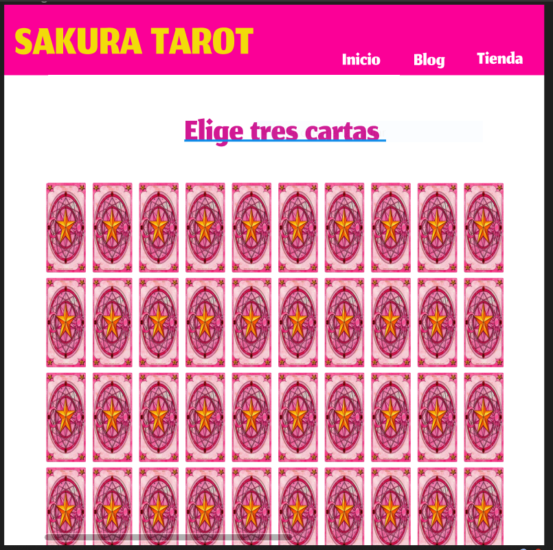
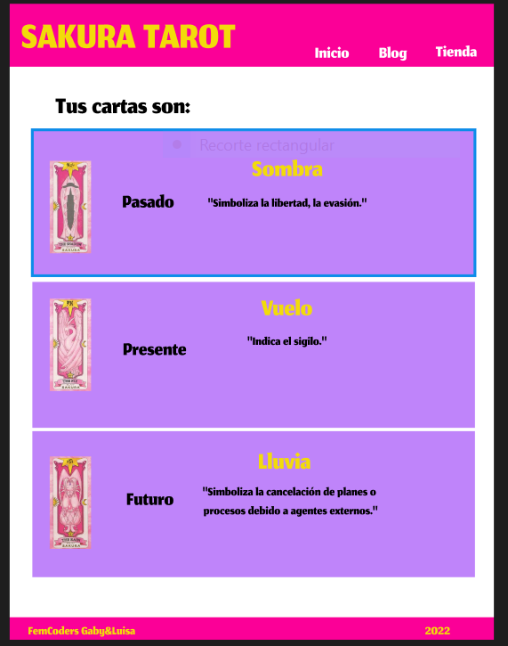

## Table of Contents
1. [General Info](#general-info)
2. [Technologies](#technologies)
3. [Installation](#installation)
4. [Collaboration](#collaboration)

### General Info
***
Dynamic Sakura tarot website
### Screenshot


## Technologies
***
A list of technologies used within the project:
* [React.js](https://reactjs.org/)
* [CSS](https://www.w3schools.com/Css/)
* [HTML](https://www.w3schools.com/html/)
* [Javascript](https://www.javascript.com/)
## Installation
***
```
$ git clone https://github.com/gabrielabarajas/sakura-lg.git
$ npm install
$ npm start
```
## Authors
***
* [Gaby](https://github.com/gabrielabarajas/sakura-lg/)
* [Luisa](hhttps://github.com/LuisaVAZ/LuisaVAZ)

